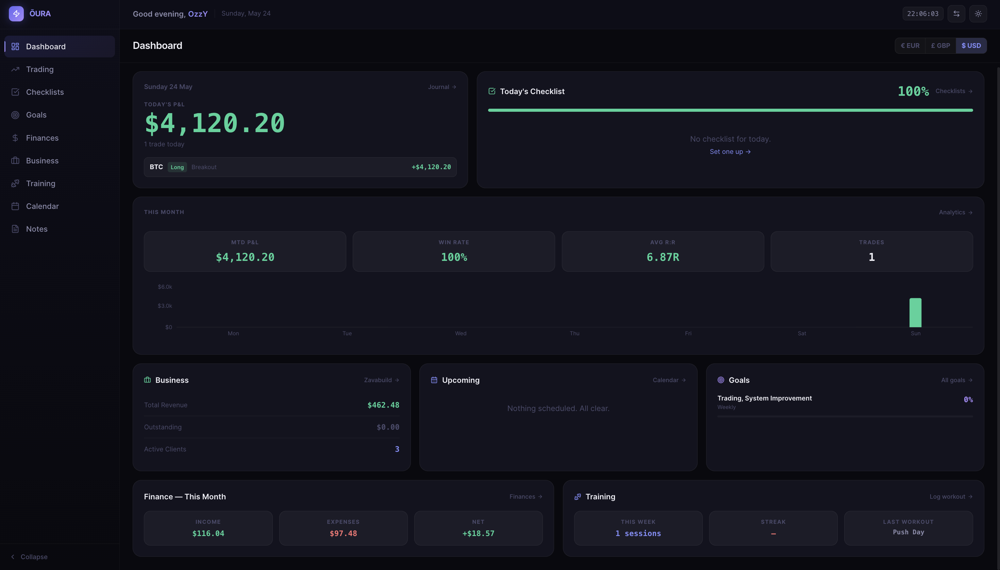
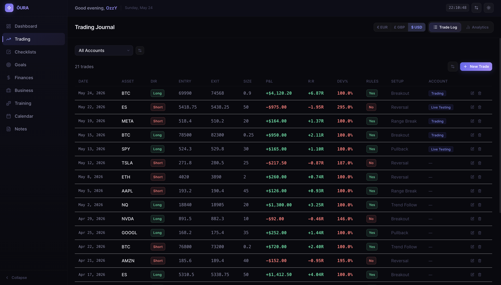
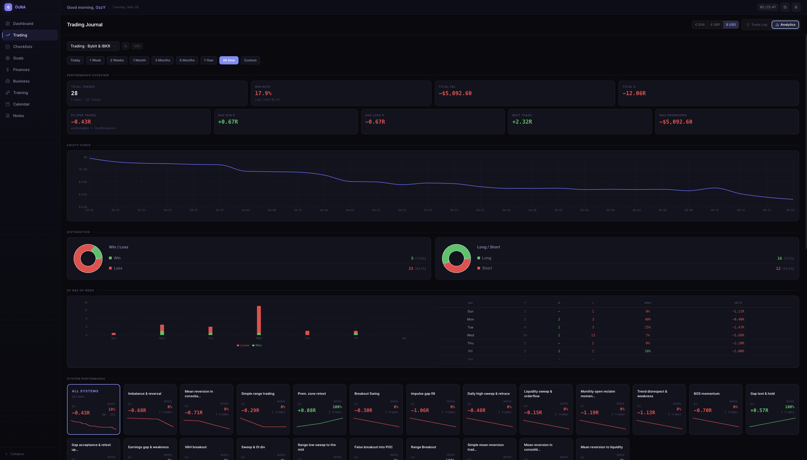
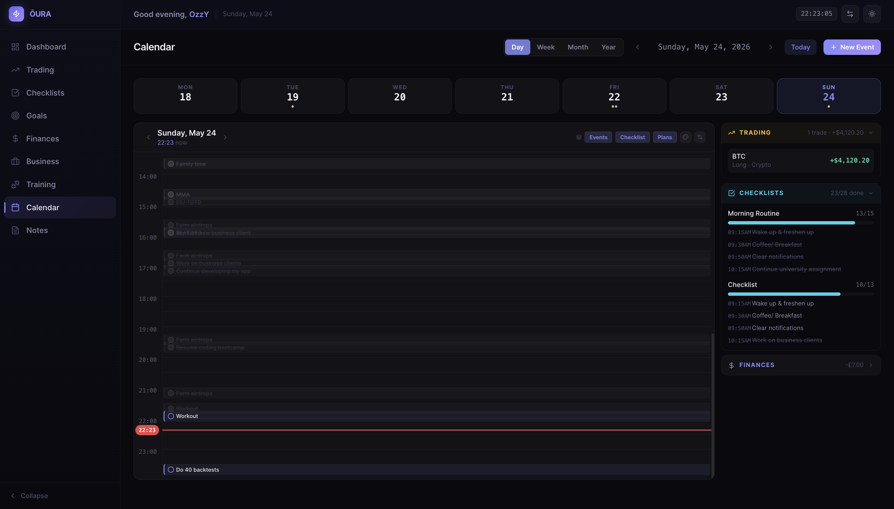
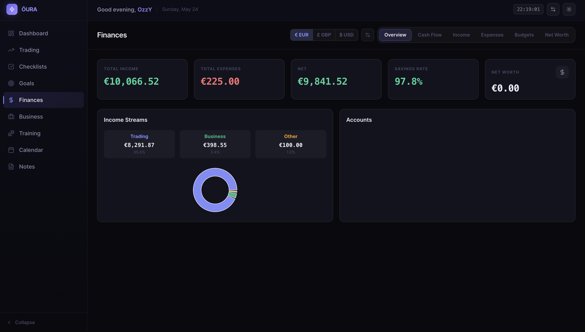
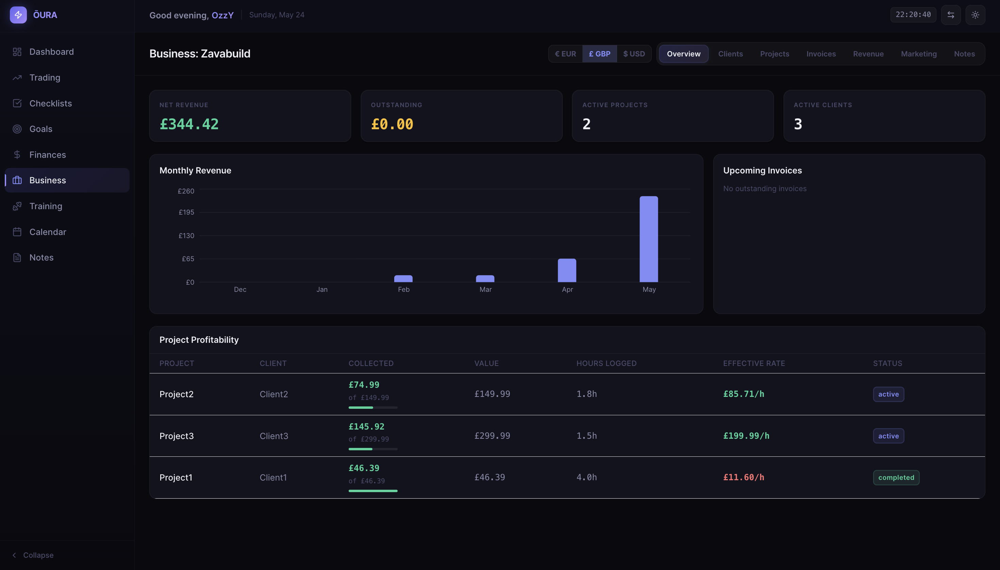
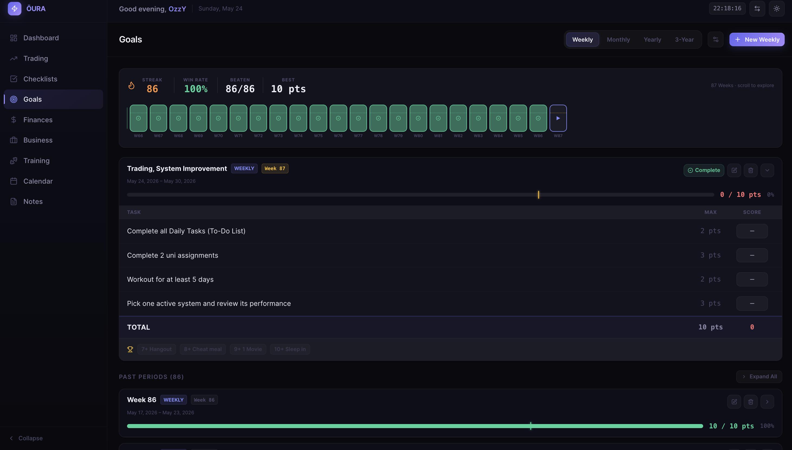
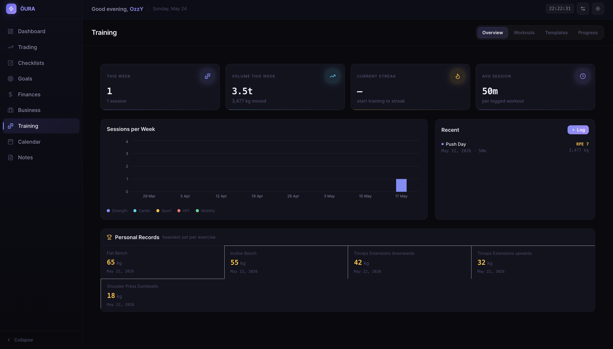
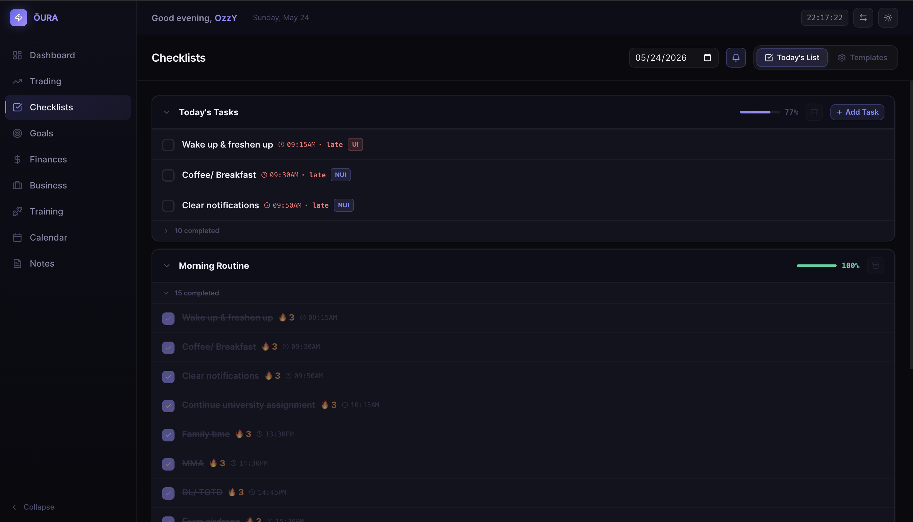
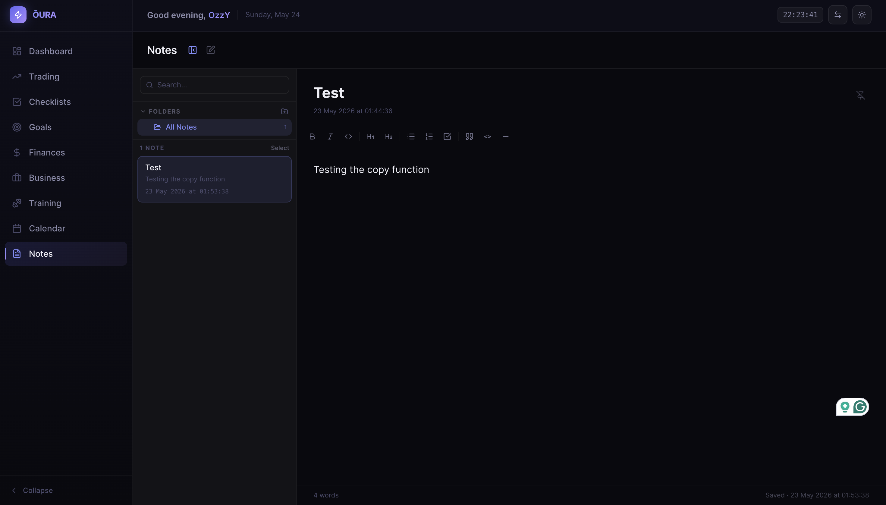

# Oura - Life Management Dashboard

## Overview
Oura is a local-first life management dashboard built with React, Express, and SQLite. It brings together every area of daily life - trading, business, finances, goals, training, calendar, and notes - into a single dark-mode interface that runs entirely on your machine. No accounts, no cloud sync, no telemetry. Everything stays local.

## Technologies
- **Frontend**: React 18, TypeScript, Vite, Tailwind CSS, TanStack Query v5, Recharts
- **Backend**: Node.js, Express
- **Database**: SQLite via Drizzle ORM + better-sqlite3
- **Image Uploads**: Multer
- **Rich Text**: Tiptap

## Modules
- **Dashboard** - Daily summary pulling live data from every module: P&L, upcoming invoices, goal deadlines, workout status, checklist progress, and finance snapshot.
- **Trading Journal** - Log trades with entry, exit, size, direction, instrument, and risk. Auto-computes P&L, R:R ratio, and deviation. Full analytics tab with equity curve, drawdown, win rate, per-instrument breakdowns, and date range filtering.
- **Business** - Client and project management with invoice tracking, time logging, recurring invoice automation, and project profitability.
- **Finances** - Account balances, income streams, expense tracking with recurring support, budget overview, net worth history, and cash flow.
- **Goals** - Hierarchical goal tree with parent-child progress propagation. Set deadlines, track percentage completion, and cascade progress automatically up the tree.
- **Training** - Workout logging with body metrics tracking. Log sets, reps, weights, and monitor body composition over time.
- **Calendar** - Life OS calendar with Day, Week, Month, and Year views. Day view features a 24-hour time grid with layered event, checklist, and trading session bands, plus a collapsible intel panel aggregating data from every module.
- **Checklists** - Daily routine checklists with template support, time-scheduled items, and ad-hoc task additions.
- **Notes** - Rich text notes with Tiptap editor, image embedding, and tagging.

## Screenshots

<table>
  <tr>
    <td align="center"><br/><sub>Dashboard</sub></td>
    <td align="center"><br/><sub>Trading Journal</sub></td>
  </tr>
  <tr>
    <td align="center"><br/><sub>Trading Analytics</sub></td>
    <td align="center"><br/><sub>Calendar - Day View</sub></td>
  </tr>
  <tr>
    <td align="center"><br/><sub>Finances</sub></td>
    <td align="center"><br/><sub>Business</sub></td>
  </tr>
  <tr>
    <td align="center"><br/><sub>Goals</sub></td>
    <td align="center"><br/><sub>Training</sub></td>
  </tr>
  <tr>
    <td align="center"><br/><sub>Checklists</sub></td>
    <td align="center"><br/><sub>Notes</sub></td>
  </tr>
</table>

## Installation
1. Clone the repository:
   ```
   git clone https://github.com/OzzYGreco/oura-life-management-dashboard.git
   ```
2. Navigate to the project directory:
   ```
   cd oura-life-management-dashboard
   ```
3. Install dependencies (root, client, and server):
   ```
   npm install
   ```
4. Apply database migrations:
   ```
   npm run db:migrate
   ```
5. Start both the client and server:
   ```
   npm run dev
   ```
6. Open your browser at: `http://localhost:5173`

## Usage
- The app runs fully offline. All data is stored in `server/data/dashboard.db` on your machine.
- The client dev server runs at `http://localhost:5173` and proxies all `/api/*` requests to the Express server at `http://localhost:3001`.
- Uploaded images (trade screenshots, note images) are stored under `server/uploads/` and served as static files.
- Recurring expenses, income, and invoices are auto-generated on server startup and on each relevant GET request.
- To reset your data, delete `server/data/dashboard.db` and re-run `npm run db:migrate`.

## Contributing
Contributions are welcome! To contribute:
1. Fork the repository.
2. Create a new branch (`git checkout -b feature-branch`).
3. Commit your changes (`git commit -m 'Add new feature'`).
4. Push to the branch (`git push origin feature-branch`).
5. Open a pull request.

## License
MIT License
